# SYNQ 📱
> A secure, cloud-synced, enterprise-grade contact management engine built with modern full-stack web architectures.

---

## 🚀 Key Value Propositions

Most contact tools treat portfolios as trivial CRUD tables. SYNQ scales data integrity and secure communication by focusing on real-world engineering constraints:

* **Robust OAuth2 Ecosystem:** Native seamless profile sync pipelines utilizing Spring Security 6 mapping hooks for Google accounts, handling background registration and session sync without data mismatches.
* **Preventing IDOR Vulnerabilities:** Complete data isolation context. Resource endpoints natively inspect authentication parameters, ensuring users can never enumerate, view, or delete other users' contact data through direct URL modification.
* **High-Fidelity Client-Side Previews:** Zero-latency asset updates. Integrated HTML5 FileReader background pipelines allow immediate verification of custom images before triggering cloud storage execution.
* **Cloud-Native Asset Pipelines:** Decoupled media workflows leveraging Cloudinary API integrations to handle heavy payload mutations away from the main server threads.

---

## 🛠️ Tech Stack & Architecture

### Backend Core
* **Framework:** Spring Boot 3.x (Spring MVC, Spring Data JPA)
* **Security:** Spring Security 6.x (Form Login, OAuth2 Client, BCrypt Encryption)
* **Database:** PostgreSQL
* **Templating:** Thymeleaf 3.1 (Layout Dialect, Fragment Decoupling)

### Frontend Engine
* **Styling:** Tailwind CSS
* **UI Components:** Flowbite & SweetAlert2
* **Async Layer:** Native JavaScript Fetch API

---

## ⚙️ Local Development Setup

### Prerequisites

* Java Development Kit (JDK 17 or higher)
* PostgreSQL Database Server
* Google & LinkedIn Developer Console accounts (for OAuth2)
* Cloudinary Developer account
* MailerSend account (or alternative SMTP server credentials)

### 1. Database & Cloud Configuration

Create an `application.properties` file inside `src/main/resources` and configure your environment properties:

```properties
# Server Configuration
spring.application.name=synq
server.port=8081

# Data Source Connection Configuration
spring.datasource.url=${DB_URL:jdbc:postgresql://localhost:5432/synq_db}
spring.datasource.username=${DB_USERNAME:postgres}
spring.datasource.password=${DB_PASSWORD:0000}
spring.datasource.driver-class-name=org.postgresql.Driver

# Hibernate & Schema Management
spring.jpa.hibernate.ddl-auto=update
spring.jpa.show-sql=true

# Spring Security OAuth2 Configuration (Google)
spring.security.oauth2.client.registration.google.client-name=google
spring.security.oauth2.client.registration.google.client-id=${GOOGLE_CLIENT_ID:your_fallback_client_id}
spring.security.oauth2.client.registration.google.client-secret=${GOOGLE_CLIENT_SECRET:your_fallback_client_secret}

# Spring Security OAuth2 Configuration (LinkedIn)
spring.security.oauth2.client.provider.linkedin.authorization-uri=https://www.linkedin.com/oauth/v2/authorization
spring.security.oauth2.client.provider.linkedin.token-uri=https://www.linkedin.com/oauth/v2/accessToken
spring.security.oauth2.client.provider.linkedin.user-info-uri=https://api.linkedin.com/v2/userinfo
spring.security.oauth2.client.provider.linkedin.user-name-attribute=sub

spring.security.oauth2.client.registration.linkedin.client-name=linkedin
spring.security.oauth2.client.registration.linkedin.client-id=${LINKEDIN_CLIENT_ID:your_fallback_linkedin_id}
spring.security.oauth2.client.registration.linkedin.client-secret=${LINKEDIN_CLIENT_SECRET:your_fallback_linkedin_secret}
spring.security.oauth2.client.registration.linkedin.scope=openid,profile,email
spring.security.oauth2.client.registration.linkedin.client-authentication-method=client_secret_post
spring.security.oauth2.client.registration.linkedin.authorization-grant-type=authorization_code
spring.security.oauth2.client.registration.linkedin.redirect-uri={baseUrl}/login/oauth2/code/{registrationId}
spring.security.oauth2.client.registration.linkedin.provider=linkedin

# Cloudinary Integration
cloudinary.cloud.name=${CLOUDINARY_NAME:your_fallback_cloud_name}
cloudinary.api.key=${CLOUDINARY_API_KEY:your_fallback_api_key}
cloudinary.api-secret=${CLOUDINARY_API_SECRET:your_fallback_api_secret}

# Email Service Configuration (MailerSend SMTP)
spring.mail.host=${MAIL_HOST:smtp.mailersend.net}
spring.mail.port=${MAIL_PORT:587}
spring.mail.username=${MAIL_USERNAME:MS_default@yourdomain.com}
spring.mail.password=${MAIL_PASSWORD:default_password}
spring.mail.properties.mail.smtp.auth=true
spring.mail.properties.mail.smtp.starttls.enable=true
app.mail.from=${MAIL_FROM_ADDRESS:info@yourdomain.com}
```

### 2. Frontend Assets

```bash
npm install
```

### 3. Build and Run

```bash
./mvnw clean spring-boot:run
```

---

## 🗺️ System Architecture

```mermaid
flowchart TD

subgraph group_runtime["Runtime"]
   node_synq_app(("Synq Spring Boot app"))
end

subgraph group_web["Web"]
   node_root_controller["Root MVC controller"]
   node_page_controller["Pages MVC controller"]
   node_auth_controller["Auth MVC controller"]
   node_user_controller["User MVC controller"]
   node_contact_controller["Contacts MVC controller"]
   node_api_controller["API MVC controller"]
end

subgraph group_domain["Domain"]
   node_user_entity(("User JPA entity"))
   node_contact_entity(("Contact JPA entity"))
   node_social_link(("SocialLink JPA entity"))
   node_user_form["UserForm request form"]
   node_contact_form["ContactForm request form"]
   node_contact_search_form["SearchForm request form"]
end

subgraph group_services["Services"]
   node_user_service{{"UserSvc"}}
   node_contact_service{{"ContactSvc"}}
   node_email_service{{"EmailSvc"}}
   node_image_service{{"ImageSvc"}}
end

subgraph group_data["Data"]
   node_user_repo[("UserRepo JPA repository")]
   node_contact_repo[("ContactRepo JPA repository")]
end

subgraph group_infra["Infrastructure"]
   node_security_config["Security"]
   node_oauth_service["OAuth2 auth adapter"]
   node_success_handler["Success auth handler"]
   node_failure_handler["Failure auth handler"]
   node_details_service["Details security adapter"]
   node_security_user_service["AuthUserSvc security service"]
   node_app_config["AppConfig framework config"]
   node_file_validator["FileValidator"]
   node_valid_file["ValidFile annotation"]
end

node_synq_app -->|"bootstraps"| node_root_controller
node_synq_app -->|"configures"| node_security_config
node_root_controller -->|"routes"| node_page_controller
node_root_controller -->|"routes"| node_auth_controller
node_root_controller -->|"routes"| node_user_controller
node_root_controller -->|"routes"| node_contact_controller
node_root_controller -->|"routes"| node_api_controller

node_auth_controller -->|"uses"| node_user_service
node_user_controller -->|"uses"| node_user_service
node_contact_controller -->|"uses"| node_contact_service
node_api_controller -->|"uses"| node_contact_service

node_user_service -->|"persists"| node_user_repo
node_contact_service -->|"persists"| node_contact_repo
node_user_service -->|"delegates"| node_email_service
node_contact_service -->|"validates via"| node_file_validator
node_file_validator -->|"implements"| node_valid_file

node_security_config -->|"uses"| node_oauth_service
node_security_config -->|"uses"| node_success_handler
node_security_config -->|"uses"| node_failure_handler
node_security_config -->|"uses"| node_details_service
node_details_service -->|"backed by"| node_security_user_service
node_security_user_service -->|"reads"| node_user_repo

node_user_service -->|"manages"| node_user_entity
node_contact_service -->|"manages"| node_contact_entity
node_contact_service -->|"manages"| node_social_link

node_page_controller -->|"binds"| node_user_form
node_contact_controller -->|"binds"| node_contact_form
node_contact_controller -->|"binds"| node_contact_search_form

node_user_controller -.->|"uses"| node_app_config
node_contact_service -->|"uploads to"| node_image_service

click node_synq_app "https://github.com/abhip47/synq/blob/main/src/main/java/com/synq/SynqApplication.java"
click node_root_controller "https://github.com/abhip47/synq/blob/main/src/main/java/com/synq/controller/RootController.java"
click node_page_controller "https://github.com/abhip47/synq/blob/main/src/main/java/com/synq/controller/PageController.java"
click node_auth_controller "https://github.com/abhip47/synq/blob/main/src/main/java/com/synq/controller/AuthController.java"
click node_user_controller "https://github.com/abhip47/synq/blob/main/src/main/java/com/synq/controller/UserController.java"
click node_contact_controller "https://github.com/abhip47/synq/blob/main/src/main/java/com/synq/controller/ContactController.java"
click node_api_controller "https://github.com/abhip47/synq/blob/main/src/main/java/com/synq/controller/ApiController.java"
click node_user_entity "https://github.com/abhip47/synq/blob/main/src/main/java/com/synq/entity/User.java"
click node_contact_entity "https://github.com/abhip47/synq/blob/main/src/main/java/com/synq/entity/Contact.java"
click node_social_link "https://github.com/abhip47/synq/blob/main/src/main/java/com/synq/entity/SocialLink.java"
click node_user_form "https://github.com/abhip47/synq/blob/main/src/main/java/com/synq/forms/UserForm.java"
click node_contact_form "https://github.com/abhip47/synq/blob/main/src/main/java/com/synq/forms/ContactForm.java"
click node_contact_search_form "https://github.com/abhip47/synq/blob/main/src/main/java/com/synq/forms/ContactSearchForm.java"
click node_user_service "https://github.com/abhip47/synq/blob/main/src/main/java/com/synq/service/UserService.java"
click node_contact_service "https://github.com/abhip47/synq/blob/main/src/main/java/com/synq/service/ContactService.java"
click node_email_service "https://github.com/abhip47/synq/blob/main/src/main/java/com/synq/service/EmailService.java"
click node_image_service "https://github.com/abhip47/synq/blob/main/src/main/java/com/synq/service/ImageService.java"
click node_user_repo "https://github.com/abhip47/synq/blob/main/src/main/java/com/synq/repository/UserRepo.java"
click node_contact_repo "https://github.com/abhip47/synq/blob/main/src/main/java/com/synq/repository/ContactRepo.java"
click node_security_config "https://github.com/abhip47/synq/blob/main/src/main/java/com/synq/config/SecurityConfig.java"
click node_oauth_service "https://github.com/abhip47/synq/blob/main/src/main/java/com/synq/config/CustomOAuth2UserService.java"
click node_success_handler "https://github.com/abhip47/synq/blob/main/src/main/java/com/synq/config/OAuthenticationSuccessHandler.java"
click node_failure_handler "https://github.com/abhip47/synq/blob/main/src/main/java/com/synq/config/AuthFailureHandler.java"
click node_details_service "https://github.com/abhip47/synq/blob/main/src/main/java/com/synq/config/UserDetailsImpl.java"
click node_security_user_service "https://github.com/abhip47/synq/blob/main/src/main/java/com/synq/service/serviceImplementation/SecurityCustomDetailService.java"
click node_app_config "https://github.com/abhip47/synq/blob/main/src/main/java/com/synq/config/AppConfig.java"
click node_file_validator "https://github.com/abhip47/synq/blob/main/src/main/java/com/synq/validators/FileValidator.java"
click node_valid_file "https://github.com/abhip47/synq/blob/main/src/main/java/com/synq/validators/ValidFile.java"

classDef toneBlue fill:#dbeafe,stroke:#2563eb,stroke-width:1.5px,color:#172554
classDef toneAmber fill:#fef3c7,stroke:#d97706,stroke-width:1.5px,color:#78350f
classDef toneMint fill:#dcfce7,stroke:#16a34a,stroke-width:1.5px,color:#14532d
classDef toneRose fill:#ffe4e6,stroke:#e11d48,stroke-width:1.5px,color:#881337
classDef toneIndigo fill:#e0e7ff,stroke:#4f46e5,stroke-width:1.5px,color:#312e81
classDef toneTeal fill:#ccfbf1,stroke:#0f766e,stroke-width:1.5px,color:#134e4a

class node_synq_app toneBlue
class node_root_controller,node_page_controller,node_auth_controller,node_user_controller,node_contact_controller,node_api_controller toneAmber
class node_user_entity,node_contact_entity,node_social_link,node_user_form,node_contact_form,node_contact_search_form toneMint
class node_user_service,node_contact_service,node_email_service,node_image_service toneRose
class node_user_repo,node_contact_repo toneIndigo
class node_security_config,node_oauth_service,node_success_handler,node_failure_handler,node_details_service,node_security_user_service,node_app_config,node_file_validator,node_valid_file toneTeal
```


